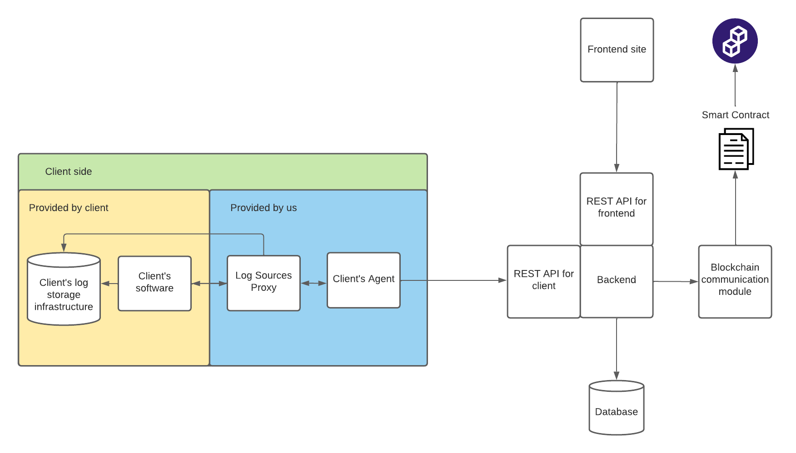

<h3 align="center">
	LogForgeryBlocker
</h3>

<!-- TABLE OF CONTENTS -->

  
Table of Contents

  <ol>
    <li>
      <a href="#about-the-project">About The Project</a>
      <ul>
        <li><a href="#architecture-diagram">Architecture Diagram</a></li>
        <li><a href="#built-with">Built With</a></li>
      </ul>
    </li>
    <li>
      <a href="#getting-started">Getting Started</a>
      <ul>
        <li><a href="#prerequisites">Prerequisites</a></li>
        <li><a href="#installation">Installation</a></li>
      </ul>
    </li>
  </ol>

<!-- ABOUT THE PROJECT -->

## About The Project

Every information system generates some logs. Some less, some more important. In most cases they are only used for development purposes, but sometimes their value for the business is much bigger. In such cases, the non-repudiation and auditability of the logs play a big role.

We are creating a service that will provide a safe and reliable way of storing logs in a way that they are immutable and their authenticity can be verified. The main idea behind it being trust distribution, achieved by storing some kind of fingerprints of the logs in a decentralized manner - on a blockchain.

### Architecture Diagram

### Built With

- [Node.js](https://nodejs.org/en/)
- [Solidity](https://soliditylang.org/)

(<a href="#top">back to top</a>)

<!-- GETTING STARTED -->

## Getting Started

This is an example of how you may give instructions on setting up your project locally.
To get a local copy up and running follow these simple example steps.

### Prerequisites

`yarn` package manager

`node`

`docker`

#### Required in .env file

`DATABASE_URL="postgresql://admin:password@db:5432/lfb-database?schema=public"`

`JWT_SECRET_KEY=<Authentication secret key>`

`PRIVATE_KEY=<Blockchain Wallet Private Key>`

`ALCHEMY_API_KEY=<Api Key for Alchemy Api>`

### Installation

#### Running in docker

#### `docker compose build`

Builds all docker images.

#### `docker compose up`

Runs all backend images.

Use `-d` flag to run in detached mode, add `backend` or `db` at the end, to run only specific service.

#### Running locally

Note: To run project manually, a database must be runninng, with configuration as in DATABASE_URL.

#### `yarn install`

Installs dependencies.

#### `yarn build`

Builds the app for production to the `dist` folder.

#### `yarn start`

Starts server in development mode on port 3000.

(<a href="#top">back to top</a>)

